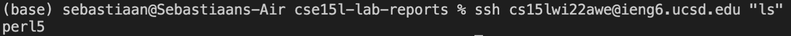

# Logging In Remotely
## How to log into a course specific account on .ieng6
---

Step 1:  **Installing VScode**

First, install VScode if you do not already have it on your device. Search VScode on google, click on their website, and **download the correct version for your operating sustem** (i.e. Mac or Linux).

>Open VScode after downloading. The window should look similar to the image below

---
---

Step 2. **Connecting Remotely**

Initially, you must find your course-specific account through this link.

>[Link](https://sdacs.ucsd.edu/~icc/index.php)

Once found, in VScode click on **Terminal-->New Terminal** in the menu, and input this command using YOUR account (not the example one below).

$ `ssh cs15lwi22aaa@ieng6.ucsd.edu`

Then type in your password and press enter (you will not be able to see letters as you are typing your password). The output should look similar to the image below.

---
---

Step 3. **Learning Commands**

Here are examples of some commands to try on both the remote and your local device:

1. `cd` --> This changes the directory
2. `cd` --> This changes directory to home
3. `ls` --> This lists all files in current directory
 4. `ls -l` --> More info than `ls` includingdate modified

Below is an exmaple of using `cd ~` on the local device. Note the change of directory

---
---

Step 4. **Moving Files With scp**

If you want to move a file from your local computer to the remote, you can use the `scp` command. To move a file called *WhereAmI.java* to ieng6, use the following command:

`$ scp WhereAmI.java cs15lwi22aaa@ieng6.ucsd.edu:~/`

This is what it will look like when you call `ls` while on the remote server after running the above scp command:

*WhereAmI.java* now shows up when files are listed on the remote because you have used `scp` to add it to the remote!

---
---

Step 5. **Setting up an SSH key**

To avoid having to authenticate each time, set up a key to make logging in easier. Below are the steps to do this:

1. $ `ssh-keygen`
2. Enter file to save key, for example: `/Users/example/.ssh/id`
3. $ `ssh cs15lwi22aaa@ieng6.ucsd.edu`
4. $ `mkdir .ssh`
5. $ `exit` (log out of the remote)
6. $ `scp /Users/example/.ssh/id.pub cs15lwi22aaa@ieng6.ucsd.edu:~/.ssh/authorized_keys`

This is what the login should look like now:

---
---

Step 6. **More Remote Running Tips**

One helpful tip is that you can combine the ssh login step with other commands. For example, if you had moves files over to the remote two weeks ago with `scp` and you wanted to check what you had moved, you could enter the following command:

$ `ssh cs15lwi22@ieng6.ucsd.edu "ls"`

***Make sure you include quotes around the command after the ssh login!***

Below is an example of using `ls` with ssh, and shows no files have been pushed from the remote.

Additionally, to edit a file locally, then copy it to the remote server and run it, do the following. 

`$ scp WhereAmI.java cs15lwi22aaa@ieng6.ucsd.edu:~/; javac WhereAmI.java; java WhereAmI`

If you copy and paste this, then it takes 3 keystrokes (including enter) to work!