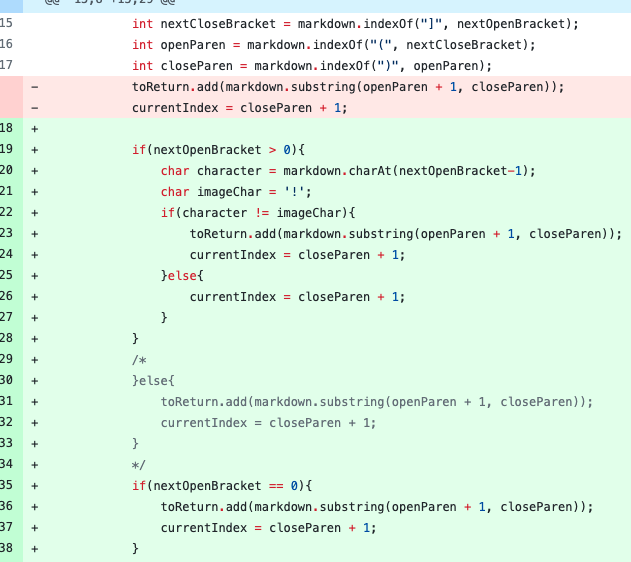
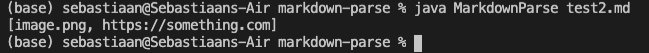
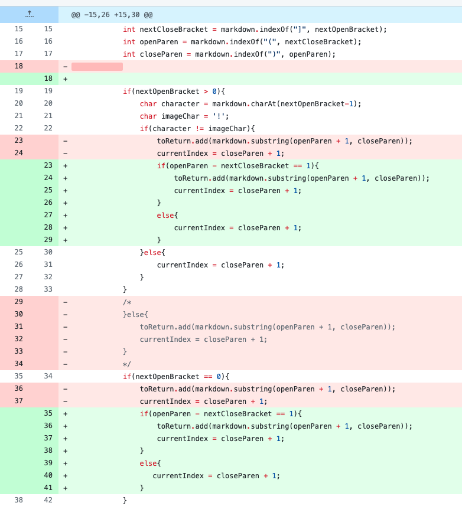
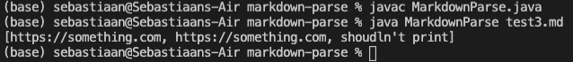
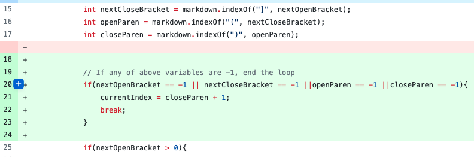
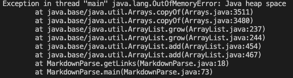

# Lab Report Week 4

## Code Change 1:

**Diff Page:**

**Test File that Prompted Change:**

[Test File](https://github.com/smvanhout/markdown-parse/blob/main/test2.md)

**Symptom of failure-inducing output:**

In this case, the bug was that images also have open/close brackets and parentheses, and the code was not checking for an exclamation point before an open bracket. The failure-inducing input was a file with an image and a link, and the symptom was that both the image and the link were included in the output, when it should have just been the link.

---
---

## Code Change 2:

**Diff Page:**

**Test File that Prompted Change:**

[Test File](https://github.com/smvanhout/markdown-parse/blob/main/test3.md)

**Symptom of failure-inducing output:**

Here, the bug was that if there was a close bracket and then an open parenthesis after but they were not directly next to eachother (greater than 1 index away), the code would still register it as a link. The failure-inducing input was a file with two correct links and one "link" with a space in the middle (so not an actual link in markdown), and the symptom was that all three "links" were included in output. In the screenshot above, "shouldn't print" should not have been in the output.

---
---

## Code Change 3:

**Diff Page:**

**Test File that Prompted Change:**

[Test File](https://github.com/smvanhout/markdown-parse/blob/main/test2.md)

**Symptom of failure-inducing output:**

For this error, the bug was that if not all the parentheses/brackets were found for the last link, there would be an infinite loop (which was the symptom of this bug). The same test file for the first problem was a failure inducing input for this problem (I edited the file to include a link missing a parenthesis so I could make sure the code could handle images and missing parentheses at the same time).