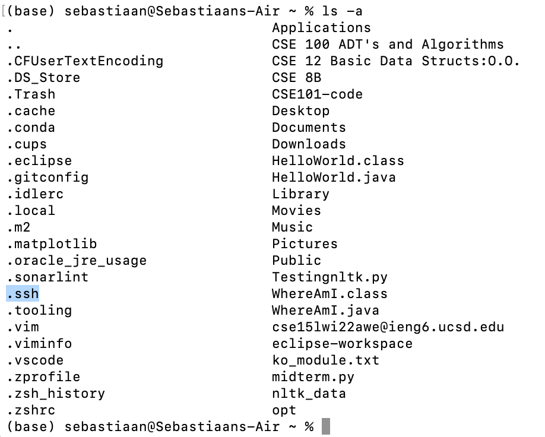
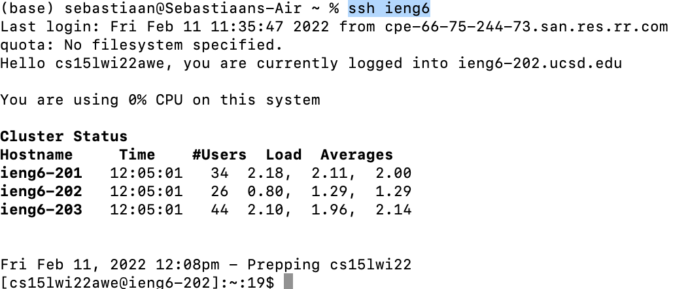
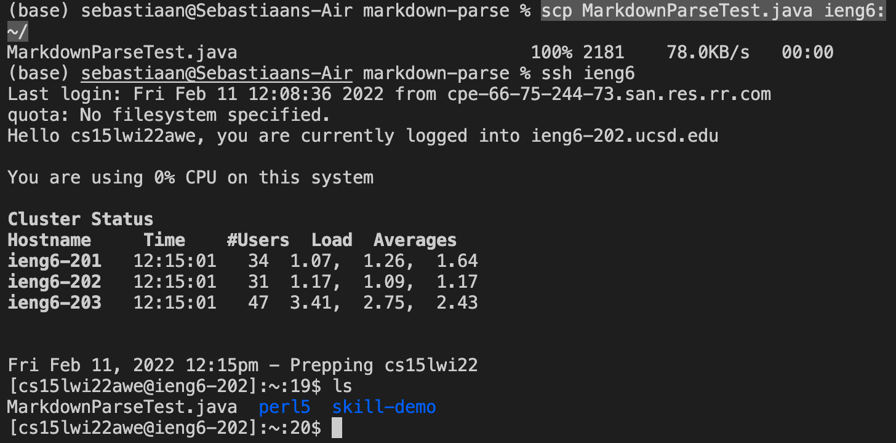

# Lab Report 3, Week 6: Streamlining .ssh Configuration

## Editing .ssh/config

I used terminal to edit .ssh/config. First, I used the command `ls -a` to find hidden files.

I found the .ssh directory, and then opened .ssh/config using the following vim command: `vim.ssh/config`

I then pressed '**i**' to go into insert mode, and wrote the text: 
> 
    Host ieng6
        HostName ieng6.ucsd.edu
        User cs15lwi22awe

Then, I pressed 'esc' and saved the changes.

---
---

## Examples of ssh and scp commands

1. Using ssh to log in  with new alias

    

2. Using scp to copy over a file. 

    Note: In screenshot below, I am using `scp` with ieng6 to copy over a file, then below I am `ssh`-ing into ieng6 and running the `ls` command to ensure that my file was copied over.

    

