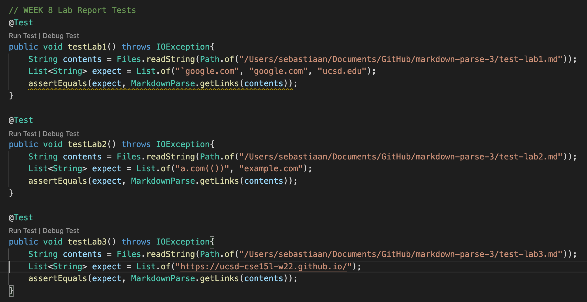
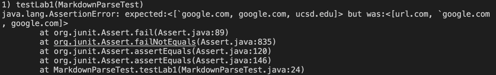
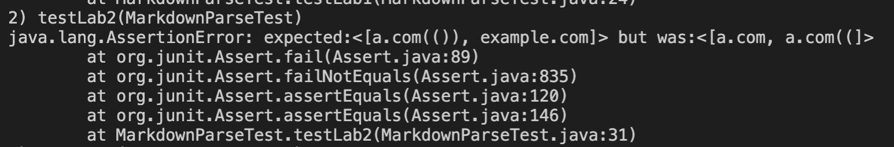
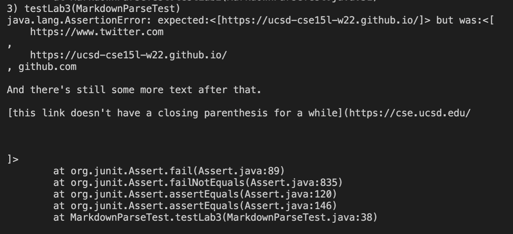
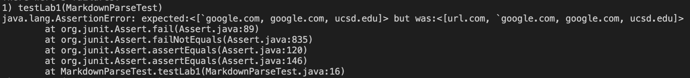
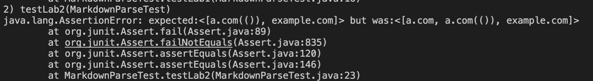
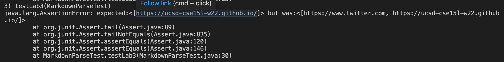

# Lab Report 4, Week 8

Link: [**My Repository**](https://github.com/smvanhout/markdown-parse)

Link: [**Code I reviewed**](https://github.com/ucsd-cse15l-w22/markdown-parse)

## Junit Tests

These are the tests I wrote to check for correct functionality in both MarkdownParse versions. I decided what should be counted as a link based on VS code's markdown preview.

## My MarkdownParse

**Snippet 1**

I think this code change would be somewhat involved, considering the 4th case in this test file (the premature close bracket). I would have to keep a running count of open and close brackets, and ensure that they were equal. For backticks before open brackets, I could keep track of a the number of backticks, and if it was odd upon getting an open bracket, I wouldn't count that bracket as a starting point (would need an even number of backticks before we consider an open bracket).

**Snippet 2**

I think a relatively involved change here is to ensure that the number of open and close parentheses is the same, and not consider the link finished until the number of close parentheses is equal to open. I could do the same for brackets as well.

**Snippet 3**

I think this would be a relatively small change. The first thing I would need to do is not consider a link that has newline characters in between the brackets. I also need to not count links themselves with newline characters.

## Implementation I Reviewed

**Snippet 1**

**Snippet 2**

**Snippet 3**

