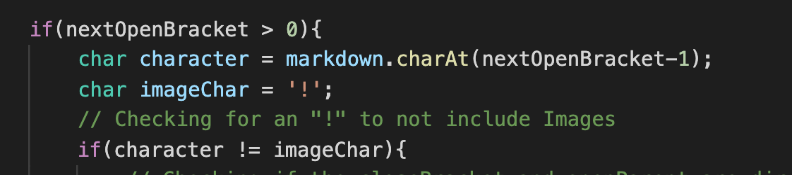
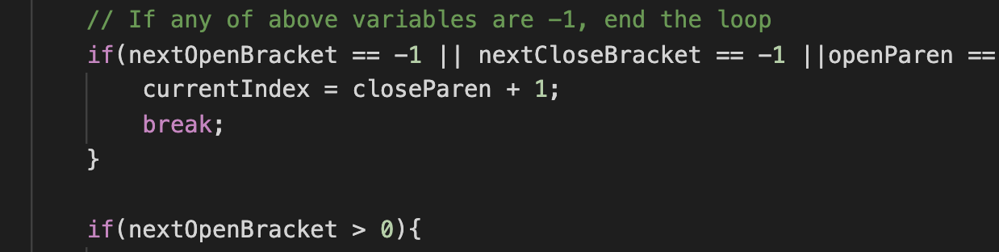

# Lab Report 5, Week 10

I first created two files by running `bash script.sh > <file_name>` on my implementation and the CSE 15L one. I stored my results to **myresults.txt**, and the other results in **results.txt**. I then dragged **results.txt** into the VS Code window with my version to copy the file. To find what tests were different between my version and the CSE 15L one, I ran `diff myresults.txt results.txt > diff.txt`, which stored the differences in a file called **diff.txt**. I then looked through this file and chose two random tests from it. I was able to locate which tests they were because **diff.txt** told me what lines in each file to look at (i.e. `212c212 [], [url]` would tell me to look at line 212 in **results.txt** and **results.txt** to find which test was producing different results).

---
---
## Difference 1
One difference occured in **test-files/507.md**.

My implementation gave: `[/url "title "and" title"]`

The CSE 15L version: `[]`

I think that the CSE 15L version is correct, as I checked test file 507 by using VS Code's preview feature, which did not indicate that there should be any link present.

**How to fix my program:**

I think that within this first if statement but before checking for excamation points, I could just check to see if indexOf "\" == -1 within the range of the correct open bracket and close paren.

---
---
## Difference 2

Another difference occured in **test-files/194.md**

My implementation gave: `[]`

The CSE 15L version: `[url]`

Here, I think neither versions are correct. When I used VS Code's preview feature on test file 194, it showed a link, but the link title was **Foo*bar]**. 

**How to fix my program:**

Right before the second if statement, I would want to call a helper method to deal with this. The helper method would track open and close parentheses and ensure that the counts matched.